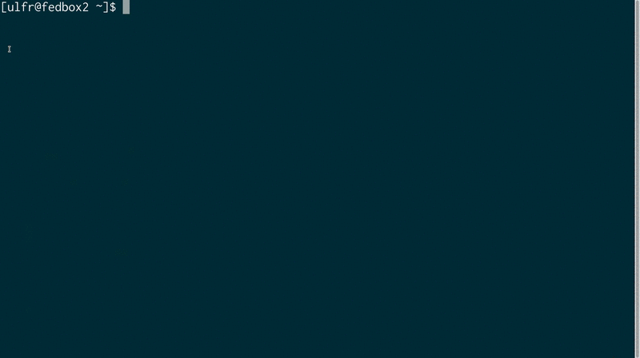

MIG: Mozilla InvestiGator
=========================


[](https://travis-ci.org/mozilla/mig)

Build one-liner:
```bash
$ go get mig.ninja/mig && cd $GOPATH/src/mig.ninja/mig && make
````

MIG is OpSec's platform for investigative surgery of remote endpoints.

MIG is composed of agents installed on all systems of an infrastructure that are
be queried in real-time to investigate the file-systems, network state, memory
or configuration of endpoints.

| Capability        | Linux | MacOS | Windows |
| ----------------- | ----- | ----- | ------- |
| file inspection   |  |  |  |
| network inspection|  |  | (partial) |
| memory inspection |  |  |  |
| vuln management   |  | (planned) | (planned) |
| log analysis      | (planned) | (planned) | (planned) |
| system auditing   | (planned) | (planned) | (planned) |

Imagine it is 7am on a saturday morning, and someone just released a
critical vulnerability for your favorite PHP application. The vuln is already
exploited and security groups are releasing indicators of compromise (IOCs).
Your weekend isn't starting great, and the thought of manually inspecting
thousands of systems isn't making it any better.

MIG can help. The signature of the vulnerable PHP app (the md5 of a file, a regex,
or just a filename) can be searched for across all your systems using
the `file` module. Similarly, IOCs such as specific log entries, backdoor files
with {md5,sha{1,256,512,3-{256,512}}} hashes, IP addresses from botnets or byte
strings in processes memories can be investigated using MIG. Suddenly, your
weekend is looking a lot better. And with just a few commands, thousands of systems
will be remotely investigated to verify that you're not at risk.



MIG agents are designed to be lightweight, secure, and easy to deploy so you can
ask your favorite sysadmins to add it to a base deployment without fear of
breaking the entire production network. All parameters are built into the agent
at compile time, including the list and ACLs of authorized investigators.
Security is enforced using PGP keys, and even if MIG's servers are compromised,
as long as our keys are safe on your investigator's laptop, no one will break
into the agents.

MIG is designed to be fast, and asynchronous. It uses AMQP to distribute actions
to endpoints, and relies on Go channels to prevent components from blocking.
Running actions and commands are stored in a Postgresql database and on disk cache,
such that the reliability of the platform doesn't depend on long-running processes.

Speed is a strong requirement. Most actions will only take a few hundreds
milliseconds to run on agents. Larger ones, for example when looking for a hash in
a big directory, should run in less than a minute or two. All in all, an
investigation usually completes in between 10 and 300 seconds.

Privacy and security are paramount. Agents never send raw data back to the
platform, but only reply to questions instead. All actions are signed by GPG
keys that are not stored in the platform, thus preventing a compromise from
taking over the entire infrastructure.

Technology
----------
MIG is built in Go and uses a REST API that receives signed JSON messages distributed
to agents via RabbitMQ and stored in a Postgres database.

It is:
* Massively Distributed means Fast.
* Simple to deploy and Cross-Platform.
* Secured using OpenPGP.
* Respectful of privacy by never retrieving raw data from endpoints.

Check out this 10 minutes video for a more general presentation and a demo of
the console interface.

[](http://www.youtube.com/watch?v=wJwj5YB6FFA)

MIG was recently presented at the SANS DFIR Summit in Austin, Tx. You can watch the recording below:

[](http://www.youtube.com/watch?v=pLyKPf3VsxM)

Discussion
----------
Join **#mig** on [irc.mozilla.org](https://wiki.mozilla.org/IRC) (use a web
client such as [mibbit](https://chat.mibbit.com) ).

Documentation
-------------
All documentation is available in the 'doc' directory and on http://mig.mozilla.org .
* [Concepts & Internal Components](doc/concepts.rst)
* [Installation & Configuration](doc/configuration.rst)

Bug & Issue tracker
-------------------
We use Bugzilla to track the work on MIG.
* List open bugs: [Bugzilla MIG](https://bugzilla.mozilla.org/showdependencytree.cgi?id=896480&hide_resolved=1)
* Create a new bug: [New Bug in
  Bugzilla](https://bugzilla.mozilla.org/enter_bug.cgi?assigned_to=nobody%40mozilla.org&blocked=896480&bug_file_loc=http%3A%2F%2F&bug_ignored=0&bug_severity=normal&bug_status=NEW&cf_fx_iteration=---&cf_fx_points=---&component=MIG&contenttypemethod=autodetect&contenttypeselection=text%2Fplain&defined_groups=1&flag_type-4=X&flag_type-607=X&flag_type-791=X&flag_type-800=X&form_name=enter_bug&maketemplate=Remember%20values%20as%20bookmarkable%20template&op_sys=Linux&priority=--&product=Enterprise%20Information%20Security&qa_contact=jvehent%40mozilla.com&rep_platform=x86_64&short_desc=[mig]%20INSERT%20DESCRIPTIVE%20TITLE%20HERE&target_milestone=---&version=unspecified)
