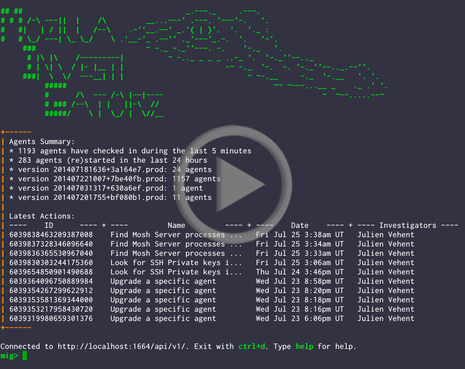

MIG: Mozilla InvestiGator
=========================

MIG is OpSec's platform for investigative surgery of remote endpoints.

MIG is composed of agents installed on all systems of an infrastructure. The
agents can be queried in real-time using a messenging protocol implemented in
the MIG Scheduler. MIG has an API, a database, RabbitMQ relays and a console
client. It allows investigators to send actions to pools of agents, and check
for indicator of compromision, verify the state of a configuration, block an
account, create a firewall rule, update a blacklist and so on.

For example: an investigator launches an action to search for an apache module
that matches a given md5 value. MIG will register the action, find all the
relevant targets and send commands to each target agent with the detail of the
action. Each agent then individually runs the action using built-in modules,
and sends the results back to the MIG platform.

Agents are designed to be lightweight, secure, and easy to deploy. All
parameters are built into the agent at compile time, include the list of
investigator's public keys. The agent binary is statically compiled for a target
platform and can be shipped without any external dependency. Deploying an agent
is as easy as `wget -O /sbin/mig-agent https://fileserver/mig-agent && /sbin/mig-agent`

MIG is designed to be fast, and asynchronous. It uses AMQP to distribute actions
to endpoints, and relies on Go channels to prevent components from blocking.
Running actions and commands are stored on disk cache, and don't rely on running
processes for reliability.

Speed is a strong requirement. Most actions will only take a few hundreds
milliseconds to run. Larger ones, for example when looking for a hash in a large
directory, should run in less than a minute or two.

Privacy and security are paramount. Agents never send raw data back to the
platform, but only reply to questions instead. All actions are signed by GPG
keys that are not stored in the platform, thus preventing a compromision from
taking over the entire infrastructure.

Discussion
----------
Join **#mig** on [irc.mozilla.org](https://wiki.mozilla.org/IRC)

Video presentation
------------------

Check out this 10 minutes video for a more general presentation and a demo of
the console interface.

Goals
-----

* Query a pool of endpoints to verify the presence of a specific indicators
  (similar to IOC, but we use a different format)
* Provide response mechanisms to lock down compromised endpoints
* Periodically verify endpoint's compliance with the security requirements

Features
--------
* Provide strong authentication of investigators
    * Actions must have a valid GPG signature, each investigator has a different
      key, for tracking.
* Provide a way to inspect remote systems for indicators of compromise (IOC).
  At the moment, this is limited to :
    * file by name
    * file content by regex
    * file hashes: md5, sha1, sha256, sha384, sha512, sha3_224,sha3_256,
      sha3_384, sha3_512
    * connected IPs
* Protect data security, investigate without intruding:
    * Raw data must not be readily available to investigators

In the work:
* More agent modules
    * low level devices (memory, file system blocks, network cards)
    * firewall rules (read & write)
    * network sniffer
    * accounts creation & destruction
    * lots more ...
* Provide response mechanisms, including:
    * dynamic firewall rules additions & removal
    * system password changes
    * process execution (execve) & destruction (kill)
* Input/Output IOCs, Yara, ... through the API
* Output results in standard format for alerting
* Investigation console

Documentation
-------------
All documentation is available in the 'doc' directory.
* [Concepts & Internal Components](doc/concepts.rst)
* [Installation & Configuration](doc/configuration.rst)

Bug & Issue tracker
-------------------
We use Bugzilla to track the work on MIG.
* List open bugs: [Bugzilla MIG](https://bugzilla.mozilla.org/showdependencytree.cgi?id=896480&hide_resolved=1)
* Create a new bug: [Bugzilla OpSec](https://bugzilla.mozilla.org/enter_bug.cgi?product=mozilla.org&component=Security%20Assurance%3A%20Operations)

